# Hands-On: Migrating to a Zero Trust Architecture on AWS (Multi-Account + Identity Center)

**Based on:** aws-samples/moving-to-a-zero-trust-architecture-in-aws  
**Focus:** Zero Trust, Verified Access, VPC Lattice, Multi-Account, IAM Identity Center, Terraform  
**Duration:** 5 hours  
**Level:** Intermediate  
**Status:** Completed  
**Author:** HoangBaoPhuoc (phuochb)  
**Co-author:** PNg-HA (Anh Pham)

---

## Overview

This workshop guides you through building a Zero Trust architecture on AWS using Terraform across multiple AWS accounts. You will use AWS Verified Access for VPN-less access, Amazon VPC Lattice for service-to-service connectivity, and IAM Identity Center for centralized authentication and authorization.

What you’ll build:

- Networking Account: VPC Lattice Service Network, Route 53 Profile/Private Hosted Zone, RAM sharing, and Parameter Store
- Frontend Account: VPC + ECS Fargate + ALB + ECR + Verified Access
- Backend Account: VPC + ECS (mservice1) + Lambda (mservice2) + ECR + VPC Lattice Services

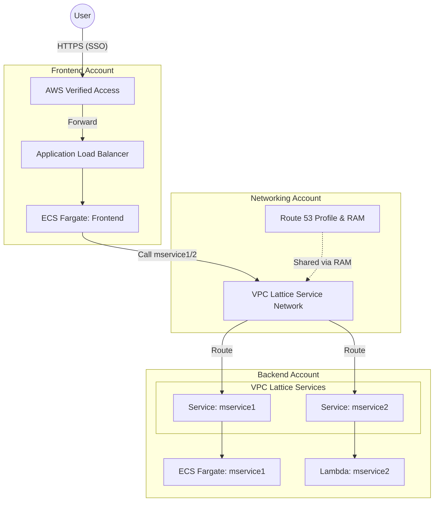

---

## Prerequisites

### AWS Resources:

- 3 AWS accounts (Network, Frontend, Backend) in one Organization
- IAM Identity Center (AWS SSO) enabled in Management Account

### Certificate Setup: Self-Signed Certificate (Lab Only)

#### Pros:

- **100% Free** - No domain purchase needed
- Quick setup (5 minutes)
- Works for learning and testing

#### Cons:

- ⚠️ Browser warnings (must click "Accept Risk")
- ⚠️ Not suitable for production
- ⚠️ AWS Verified Access may require additional configuration (handled in this guide)

#### Setup Steps:

**Step 1: Generate Self-Signed Certificate**

```bash
# 1. Create directory (if not exists) and enter it
mkdir ~/certs; cd ~/certs

# 2. Generate Key and Certificate in ONE command (Universal syntax)
# Note: We use *.zerotrust.local to make it clear this is a private/fake domain
openssl req -x509 -newkey rsa:2048 -keyout key.pem -out cert.pem -days 365 -nodes -subj "/C=VN/ST=HCM/L=HCMC/O=DevOps/OU=Lab/CN=*.zerotrust.local"

#If error you can try to implement the env of Git (in Windows)
$env:OPENSSL_CONF = "C:\Program Files\Git\usr\ssl\openssl.cnf"

# 3. Verify files exist
ls
# Expected output: cert.pem, key.pem
```

**Step 2: Import to AWS Certificate Manager (ACM)**

```bash
aws acm import-certificate \
  --certificate fileb://cert.pem \
  --private-key fileb://key.pem \
  --region ap-southeast-1 \
  --profile frontend-account
```

**Step 3: Copy the Certificate ARN**

The command will output an ARN like:

```
arn:aws:acm:ap-southeast-1:123456789012:certificate/xxxxxxxx-xxxx-xxxx-xxxx-xxxxxxxxxxxx
```

Save this ARN for `terraform.tfvars`.

**Step 4: Update terraform.tfvars**

```hcl
certificate_arn = "arn:aws:acm:ap-southeast-1:123456789012:certificate/your-cert-id"
frontend_domain_name = "zerotrust-lab.local"  # Use .local for self-signed
```

---

### Certificate Setup: .id.vn Domain (Free for VN Citizens)

#### Pros:
- ✅ **Valid Public Certificate** - No browser warnings (Secure).
- ✅ **Professional** - Real internet-accessible domain.
- ✅ **Free Cost** - Supported by "Chương trình hiện diện trực tuyến với tên miền quốc gia .id.vn" (18-23 years old).

#### Cons:
- ⚠️ Registration process takes time (KYC).
- ⚠️ Requires defined DNS management.

#### Setup Steps:

**Step 1: Register .id.vn Domain**
- Register at Vietnamese Registrars (iNET, TenTen, MatBao, etc.) for the `id.vn` program.
- **Example domain**: `nguyenvan-zta.id.vn`.

**Step 2: Create Public Hosted Zone in AWS**
1. Login to **Network Account** (Recommended) or *Frontend Account*.
2. Go to **Route 53** > **Hosted zones** > **Create hosted zone**.
3. **Domain name**: `nguyenvan-zta.id.vn` (Replace with your registered domain).
4. **Type**: **Public hosted zone**.
5. After creation, Route 53 will generate 4 **Name Servers (NS)** in the NS record.
6. Copy these 4 NS values (e.g., `ns-123.awsdns-01.com`, etc.).
7. Go to your **Domain Registrar's management page** (where you bought the domain) and **Update Name Servers** to point to these 4 AWS NS values.

**Step 3: Request Public Certificate**
1. Login to **Frontend Account**.
2. Go to **AWS Certificate Manager (ACM)** > **Request certificate** > **Request a public certificate**.
3. **Domain name**: `*.nguyenvan-zta.id.vn` (Wildcard is recommended) or `app.nguyenvan-zta.id.vn`.
4. **Validation method**: **DNS validation**.
5. Click **Request**.
6. **Validate the Certificate**:
   - Click on the Certificate ID you just created.
   - **Option A (Same Account)**: If your Route 53 Hosted Zone is in the *same* account (Frontend), click **Create records in Route 53** > **Create records**.
   - **Option B (Cross-Account - Recommended)**: If your Route 53 Hosted Zone is in the **Network Account**:
     1. Copy the **CNAME name** and **CNAME value** from the ACM console.
     2. Login to the **Network Account**.
     3. Go to **Route 53** > **Hosted zones** > Select your domain.
     4. Click **Create record**.
     5. **Record name**: Paste the CNAME name (Note: If Route 53 auto-appends the domain, ensure you don't duplicate it. Usually, paste only the `_randomstring` part).
     6. **Record type**: `CNAME`.
     7. **Value**: Paste the CNAME value.
     8. Click **Create records**.

**Step 4: Update terraform.tfvars**

Open the file `workshop/frontend/terraform.tfvars` and update the following variables:

```hcl
certificate_arn = "arn:aws:acm:ap-southeast-1:123456789012:certificate/xxxxxxxx-xxxx-xxxx-xxxx-xxxxxxxxxxxx"
frontend_domain_name = "app.nguyenvan-zta.id.vn"
```

**Step 5: Add CNAME for Application (After Deployment)**
After running Terraform (Task 5), you will get an output `verified_access_endpoint_domain` (e.g., `edge-123...amazonaws.com`).

1. Go to **Route 53** (in Network Account).
2. Create Record:
   - **Name**: `app` (or whatever subdomain you chose in `frontend_domain_name`).
   - **Type**: `CNAME`.
   - **Value**: The value from `verified_access_endpoint_domain` output.
   - **TTL**: 300.

---

### Local Tools:

- AWS CLI v2, Terraform ≥ 1.3.0, Docker installed
- Basic familiarity with Terraform and AWS IAM

---

## Workshop Scenario

You are a Cloud/Platform Engineer tasked with implementing a Zero Trust access model across multiple AWS accounts. Users must authenticate via IAM Identity Center to access a frontend app, which communicates with backend services via VPC Lattice. All infrastructure should be reproducible via Terraform and cost-optimized for a lab (tier 0).

---

## Task 1: Identity Center Setup (Configure Identity Management)

### Objective

Set up IAM Identity Center on the Management account, create users, assign permissions, and grant access to member accounts (Network, Frontend, Backend).

### Prerequisites

- Logged into the Management account (1400).
- **AWS Organizations Configured**: 3 member accounts (ZT-Network-Account, ZT-Frontend-Account, ZT-Backend-Account) must be created via AWS Organizations service before starting this task.


### Step 1: Create Groups (User Groups)

Create 3 groups to categorize user roles within the organization.

1. Navigate to **IAM Identity Center Console**.
2. In the left menu, select **Groups** > **Create group**.
3. Create the following 3 groups:
   - **Group 1**: `ZeroTrust-Admins` (Network infrastructure administrators).
   - **Group 2**: `ZeroTrust-Developers` (Application deployment developers).
   - **Group 3**: `ZeroTrust-AppUsers` (End users accessing applications).


4. Verify that all groups have been created successfully.

### Step 2: Create Users

Create a primary User (Developer) for the lab and an optional secondary User (End User) for testing access.

#### Primary User (Admin/Dev):

1. In the left menu, select **Users** > **Add user**.
2. Fill in the user details:
   - **Username**: `dev1`.
   - **Password**: Select **Generate a one-time password...** (to get password immediately).
   - **Email/Name**: Enter your information.

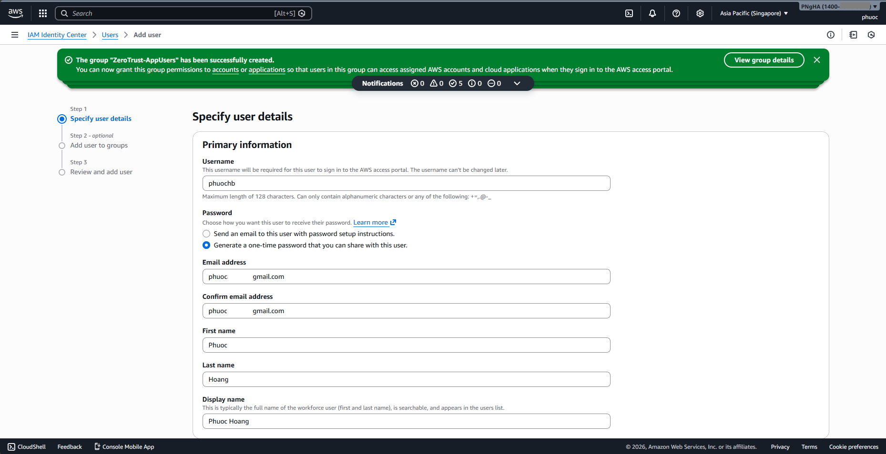

3. **Add user to groups**:
   - Add user `dev1` to both groups: `ZeroTrust-Admins` and `ZeroTrust-Developers` (to grant full lab permissions).
   - Click **Add user**.


4. **Save login information**:
   - A dialog box will appear containing Portal URL, Username, and One-time password.
   - **IMPORTANT**: Copy and save this information to a Note immediately. You will need it for subsequent tasks.


#### Secondary User (End User - Optional):

- Create an additional user `user1` and add only to the `ZeroTrust-AppUsers` group (for testing in Task 7).
  
  

### Step 3: Create Permission Sets

Define permission sets to apply to AWS accounts.

1. In the left menu, select **Permission sets** > **Create permission set**.

#### Permission Set 1: Network Admin

1. Select **Predefined permission set** > **AdministratorAccess**.
2. Name: `ZeroTrust-NetworkAdmin`.
3. Description: _"Full access for Network Account"_.
4. Click **Create**.
   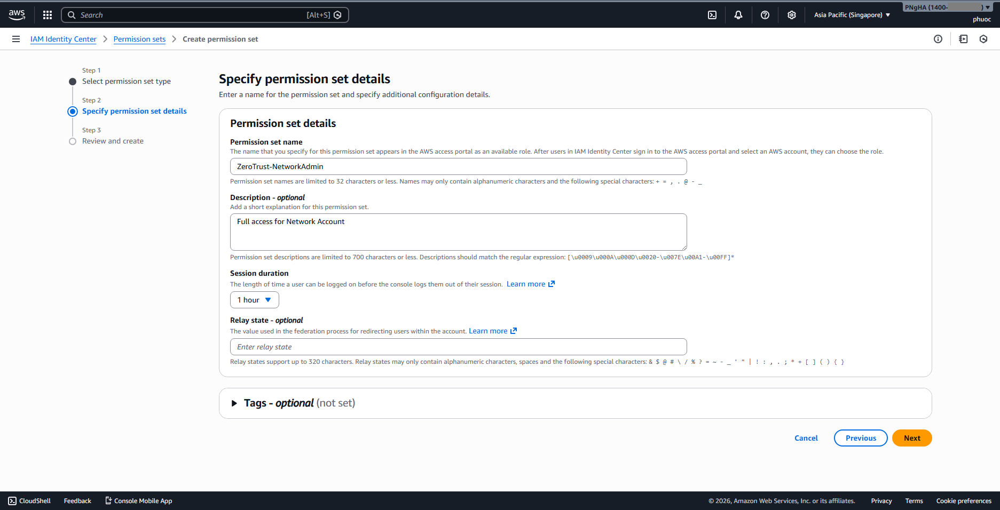

#### Permission Set 2: Application Developer

1. Select **Predefined permission set** > **PowerUserAccess** (or **AdministratorAccess** to avoid permission issues).
2. Name: `ZeroTrust-AppDeveloper`.
3. Description: _"Access for Frontend/Backend Accounts"_.
4. Note: For a smooth lab experience, you may attach additional policy `AmazonEC2ContainerRegistryFullAccess` (Inline policy) if needed, or simply use `AdministratorAccess` for this permission set to avoid permission errors during Terraform deployment.
5. Click **Create**.


### Step 4: Assign Accounts (Assign Permissions to Accounts)

This step maps: **Who (Group) + What permissions (Permission Set) + To which account (Account)**.

#### Configuration for Network Account:

1. In the left menu, select **AWS accounts**.

   **Note**: If you do not see your accounts immediately, ensure you expand the Root hierarchy or the specific Organizational Unit (OU) folder in the list view.

2. Select the `ZT-Network-Account`.
3. Click **Assign users or groups**.
4. Select the **Groups** tab > Select `ZeroTrust-Admins`.
5. Click **Next** > Select Permission Set `ZeroTrust-NetworkAdmin`.
6. Click **Submit**.


#### Configuration for Frontend & Backend Account:

1. Select both accounts `ZT-Frontend-Account` and `ZT-Backend-Account`.
2. Click **Assign users or groups**.
3. Select the **Groups** tab > Select `ZeroTrust-Developers`.
4. Click **Next** > Select Permission Set `ZeroTrust-AppDeveloper` (or `ZeroTrust-NetworkAdmin` if you prefer to grant full Admin permissions for convenience).
5. Click **Submit**.


### Step 5: Verify Access (Crucial)

Verify that the configuration is working correctly by logging in as the new user.

1. Open a **Private/Incognito browser window**.
2. Navigate to the **AWS Access Portal URL** (saved in Step 2, e.g., `https://d-xxxxxxxx.awsapps.com/start`).
3. Log in using:
   - **Username**: `dev1`
   - **Password**: The one-time password saved earlier.
4. You will be prompted to set a new password.
5. **Success Criteria**: You should see the AWS Access Portal dashboard listing all 3 accounts: ZT-Network, ZT-Frontend, and ZT-Backend.
6. Click on **ZT-Network-Account** > **Management Console** to confirm you can access the AWS Console.

---

## Task 2: Configure AWS CLI with SSO

### Objective

Set up local AWS CLI profiles (`network-account`, `frontend-account`, `backend-account`) to authenticate via IAM Identity Center. This allows Terraform to deploy resources into the correct accounts.

### Prerequisites

- **SSO Start URL**: Retrieved from Task 1 (e.g., `https://d-xxxxxxxx.awsapps.com/start`).
- **Region**: `ap-southeast-1` (Singapore).

### Step 1: Configure Network Account Profile

Run the configuration wizard to set up the SSO session and the first profile.

```bash
aws configure sso
```

Input details when prompted:

1. **SSO session name (Recommended)**: `zerotrust-lab` (Use this name to group all accounts under one login session).
2. **SSO start URL**: Enter your URL from Task 1.
3. **SSO region**: `ap-southeast-1`.
4. **SSO registration scopes [sso:account:access]**: Press Enter (Default).
5. (Browser will open → Click **"Confirm and continue"** → **"Allow"**)


6. **Select Account**: Select `ZT-Network-Account` using arrow keys.
7. **Select Role**: Select the admin role (e.g., `ZeroTrust-NetworkAdmin` or `AdministratorAccess`).
8. **CLI default client Region**: `ap-southeast-1`.
9. **CLI default output format**: `json`.
10. **CLI profile name**: `network-account` (**CRITICAL**: Must match this exact name).

### Step 2: Configure Frontend and Backend Profiles

Repeat the process for the remaining accounts. Since the session `zerotrust-lab` is already created, the wizard will be shorter.

#### For Frontend Account:

1. Run `aws configure sso`.
2. **SSO session name**: Select `zerotrust-lab` (Press Enter).
3. **Select Account**: Choose `ZT-Frontend-Account`.
4. **Select Role**: Choose the available role (e.g., `ZeroTrust-AppDeveloper`).
5. **CLI profile name**: `frontend-account` (Must match exactly).

#### For Backend Account:

1. Run `aws configure sso`.
2. **SSO session name**: Select `zerotrust-lab`.
3. **Select Account**: Choose `ZT-Backend-Account`.
4. **Select Role**: Choose the available role.
5. **CLI profile name**: `backend-account` (Must match exactly).


### Step 3: Verify Configuration

Ensure that the config file contains 3 distinct profiles and 1 SSO session.

```bash
# On Linux/Mac
cat ~/.aws/config

# On Windows PowerShell
Get-Content $env:USERPROFILE\.aws\config
```

**Expected Output**: You should see `[profile network-account]`, `[profile frontend-account]`, and `[profile backend-account]`.

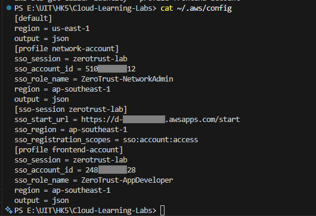

### Step 4: Login to Activate Sessions

Before running Terraform, ensure you have active credentials for all profiles.

```bash
# Login to the named profiles (This will refresh the token for the zerotrust-lab session)
aws sso login --profile network-account
aws sso login --profile frontend-account
aws sso login --profile backend-account
```

**Note**: Since they share the `zerotrust-lab` session, logging into one usually refreshes access for all associated accounts.

---

## Task 3: Prepare Repository & Variables

### Objective

Clone the repo and prepare terraform.tfvars from examples.

### Steps

1. Direct to the folder workshop:
   ```bash
   cd Cloud-Learning-Labs\labs\Migrating to Zero Trust Architecture on AWS\workshop
   ```
2. Create and fill tfvars files from provided examples:
   > **Action**: Copy the `terraform.tfvars.example` file in each folder to `terraform.tfvars`.
   
   > **Note**: Retrieve these IDs from your AWS Console:
   > - **Organization ID**: AWS Organizations console.
   > - **Account IDs**: AWS Organizations or Account dropdown menu.
   > - **Group ID**: IAM Identity Center console (Groups tab).
     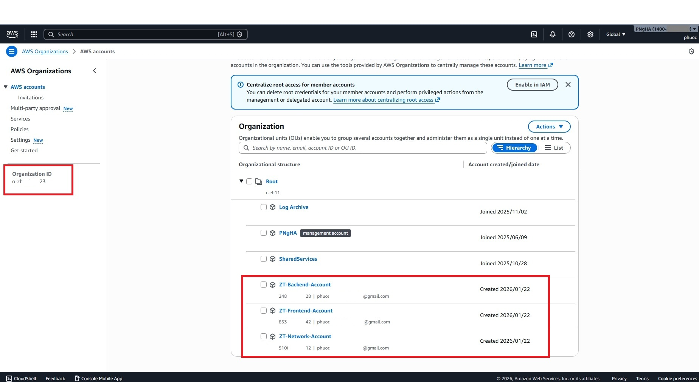
     
     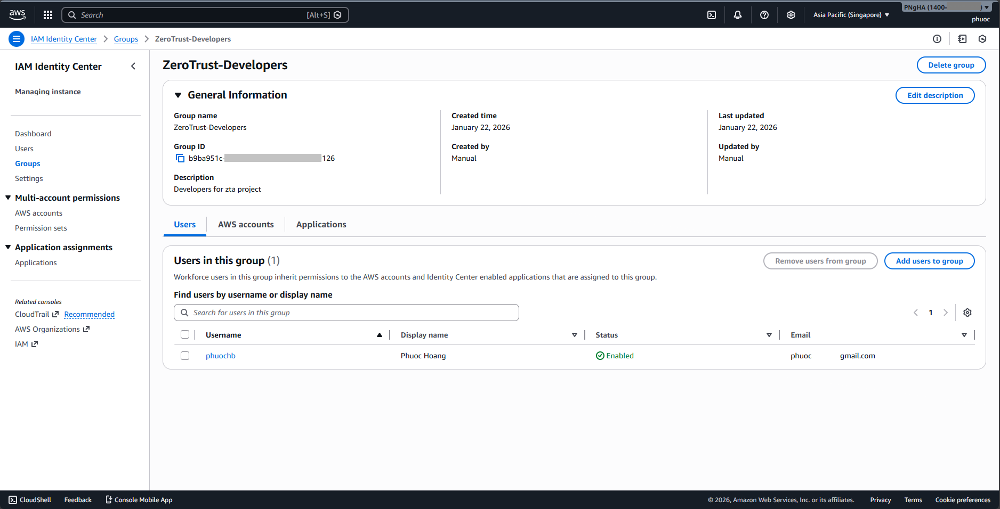
   - `network/terraform.tfvars` → `organization_id`, hosted zones, account IDs
   - `frontend/terraform.tfvars` → `certificate_arn`, `frontend_domain_name`, `idc_group_id`
   - `backend/terraform.tfvars` → `certificate_arn`, `frontend_application_role_arn` (Wait for Task 5 output)  
3. Confirm providers use SSO profiles and region `ap-southeast-1`. 

---

## Task 4: Deploy Networking Account

### Objective

Create VPC Lattice Service Network, Route 53 Profile/PHZ, and share via RAM.

### Steps

Before apply you must enable RAM sharing with AWS Organizations
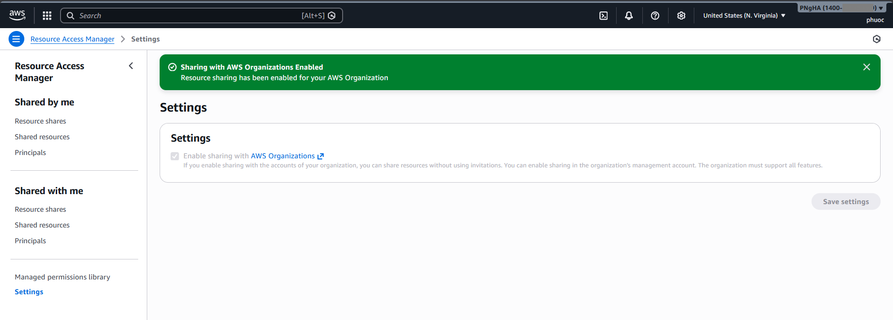

1. Login SSO and deploy:

   ```bash
   aws sso login --profile network-account

   cd workshop/network/
   terraform init
   terraform plan
   terraform apply -auto-approve
   terraform output > ../network-outputs.txt
   ```

   
   

2. Note outputs for later: `vpc_lattice_service_network_arn`, `route53_profile_id`.

---

## Task 5: Deploy Frontend Account + Build App

### Objective

Provision VPC, ECS, ALB, ECR, Verified Access; push frontend image to ECR.

### Steps

1. Deploy infrastructure:

   ```bash
   aws sso login --profile frontend-account

   cd ../frontend/
   terraform init
   terraform plan
   terraform apply -auto-approve
   terraform output > ../frontend-outputs.txt
   ```

   
   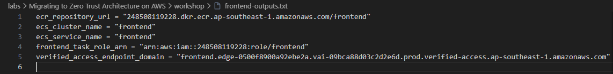
   Outputs to capture: `ecr_repository_url`, `verified_access_endpoint_url`, `frontend_task_role_arn`.

2. Build & push frontend image:
   ```bash
   # For linux or mac
   cd ../applications/portal/
   chmod +x dockerpush.sh
   ./dockerpush.sh

   # For windows (PowerShell)
   # 1. Move to folder containing code
   cd "..\applications\portal"
   
   # 2. Declare variables (Replace with your values)
   $AWS_REGION = "ap-southeast-1"
   # To get ID: aws sts get-caller-identity --query Account --output text --profile frontend-account
   $AWS_ACCOUNT_ID = "123456789012"     # Replace with your Frontend Account ID
   $ECR_REPO_NAME = "frontend"
   $AWS_PROFILE = "frontend-account"    # Replace with your SSO profile name
   
   # 3. Login ECR
   # Note: Using 'cmd /C' to avoid PowerShell pipe encoding issues
   cmd /C "aws ecr get-login-password --region $AWS_REGION --profile $AWS_PROFILE | docker login --username AWS --password-stdin $AWS_ACCOUNT_ID.dkr.ecr.$AWS_REGION.amazonaws.com"
   
   # 4. Build Image
   docker build -t $ECR_REPO_NAME .
   
   # 5. Tag & Push
   docker tag "$ECR_REPO_NAME`:latest" "$AWS_ACCOUNT_ID.dkr.ecr.$AWS_REGION.amazonaws.com/$ECR_REPO_NAME`:latest"
   docker push "$AWS_ACCOUNT_ID.dkr.ecr.$AWS_REGION.amazonaws.com/$ECR_REPO_NAME`:latest"
   ```
   
3. Force new ECS deployment to pull latest image:

   ```bash
   aws ecs update-service --cluster frontend --service frontend --force-new-deployment --profile frontend-account

   # Check service status
   aws ecs describe-services --cluster frontend --services frontend --profile frontend-account --query "services[0].{Status:status, Running:runningCount, Desired:desiredCount, Events:events[0].message}"
   ```
   
---

## Task 6: Deploy Backend Account + Build Services

### Objective

Provision VPC, ECS (mservice1), Lambda (mservice2), and Lattice Services; push image and update function.

### Steps

1. Update `backend/terraform.tfvars` with `frontend_application_role_arn` from Task 5.
2. Deploy infrastructure:

   ```bash
   aws sso login --profile backend-account

   cd ../../backend/
   terraform init
   terraform plan
   terraform apply -auto-approve
   terraform output > ../backend-outputs.txt
   ```

   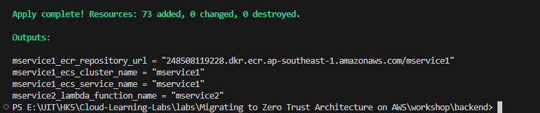
   

3. Build & push mservice1:
   ```bash
   # For linux or mac
   cd ../applications/mservice1/
   chmod +x dockerpush.sh
   ./dockerpush.sh

   # For windows (PowerShell)
   # 1. Move to folder containing code
   cd "..\applications\mservice1"
   
   # 2. Declare variables (Replace with your values)
   $AWS_REGION = "ap-southeast-1"
   # To get ID: aws sts get-caller-identity --query Account --output text --profile backend-account
   $AWS_ACCOUNT_ID = "123456789012"     # Replace with your Backend Account ID
   $ECR_REPO_NAME = "mservice1"
   $AWS_PROFILE = "backend-account"     # Replace with your SSO profile name
   
   # 3. Login ECR
   # Note: Using 'cmd /C' to avoid PowerShell pipe encoding issues
   cmd /C "aws ecr get-login-password --region $AWS_REGION --profile $AWS_PROFILE | docker login --username AWS --password-stdin $AWS_ACCOUNT_ID.dkr.ecr.$AWS_REGION.amazonaws.com"
   
   # 4. Build Image
   docker build -t $ECR_REPO_NAME .
   
   # 5. Tag & Push
   docker tag "$ECR_REPO_NAME`:latest" "$AWS_ACCOUNT_ID.dkr.ecr.$AWS_REGION.amazonaws.com/$ECR_REPO_NAME`:latest"
   docker push "$AWS_ACCOUNT_ID.dkr.ecr.$AWS_REGION.amazonaws.com/$ECR_REPO_NAME`:latest"
   ```
   
4. Force new ECS deployment to pull latest image:

   ```bash
   aws ecs update-service --cluster mservice1 --service mservice1 --force-new-deployment --profile backend-account

   # Check service status
   aws ecs describe-services --cluster mservice1 --services mservice1 --profile backend-account --query "services[0].{Status:status, Running:runningCount, Desired:desiredCount, Events:events[0].message}"
   ```
   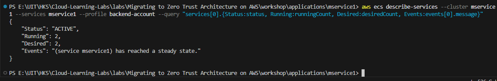
5. Update Lambda mservice2 code (if needed):
   ```bash
   # For linux or mac
   cd ../mservice2/
   zip -r mservice2.zip app2.py requirements.txt
   aws lambda update-function-code \
     --function-name <lambda_name> \
     --zip-file fileb://mservice2.zip \
     --profile backend-account

   # For windows (PowerShell)
   cd "..\mservice2"
   # 1. Zip file code
   Compress-Archive -Path app2lambda.py -DestinationPath mservice2.zip -Force
   # 2. Update code to lambda
   aws lambda update-function-code --function-name mservice2 --zip-file fileb://mservice2.zip --profile backend-account
   ```

   

---

## Task 7: Verified Access Test

### Objective

Verify login flow with IAM Identity Center and access to the frontend app.

### Steps

1. Ensure Verified Access policy references correct `idc_group_id`.  
   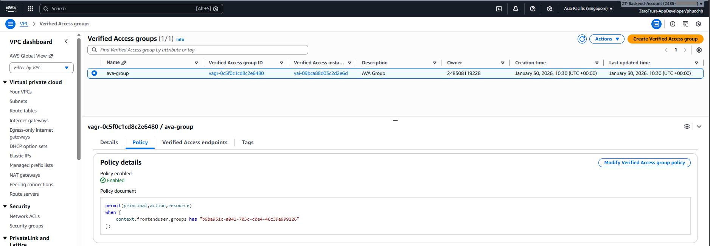
   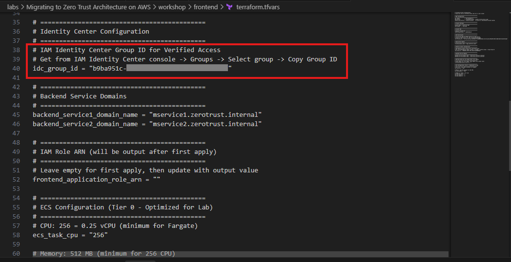
2. Open the Verified Access endpoint URL (from Task 5 outputs) or your frontend domain. 

   **Important:** Since we are using a self-signed certificate with a local domain (`app.zerotrust.local`), public DNS cannot resolve this domain. You must map it in your local `hosts` file.

   **Step 2a: Get the IP address of the Verified Access Endpoint**
   ```bash
   # Use the verified_access_endpoint_domain from Task 5 outputs
   nslookup <your-verified-access-endpoint>.edge-0fb...amazonaws.com
   # Copy one of the IP addresses returned (e.g., 18.1.2.3)
   ```
   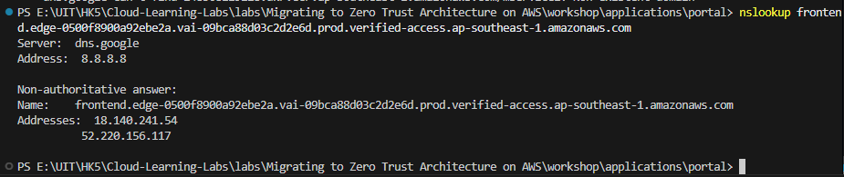
   **Step 2b: Update `hosts` file**

   **For Windows:**
   - Open Notepad as Administrator.
   - Open file: `C:\Windows\System32\drivers\etc\hosts`
   - Add the line:
     ```text
     52.220.156.117 app.zerotrust.local
     ```
   
   **For Linux/macOS:**
   - Open terminal.
   - Edit hosts file: `sudo nano /etc/hosts`
   - Add the line:
     ```text
     52.220.156.117 app.zerotrust.local
     ```

   - Access URL: https://app.zerotrust.local
   
3. Login with a user in `ZeroTrust-AppUsers` and validate application access.  
   

---

## Task 8: Monitoring & Troubleshooting

### Objective

Confirm end-to-end connectivity and inspect logs.

### Steps

1. End-to-end path: Frontend (ECS) → mservice1 (ECS) → mservice2 (Lambda) via VPC Lattice.
2. Useful CloudWatch log tails:

   ```bash
   # Frontend
   aws logs tail /ecs/frontend --follow --profile frontend-account

   # Backend ECS
   aws logs tail /ecs/mservice1 --follow --profile backend-account

   # Backend Lambda
   aws logs tail /aws/lambda/mservice2 --follow --profile backend-account
   ```

   
   
   

3. Quick tips:
   - ECS task not starting:
     - Check security groups, subnets, IAM roles (especially CloudWatch Logs permissions as guided in Task 5).
     - Review detailed logs in CloudWatch Logs to identify permission or network errors.
   - Verified Access deny/redirect issues: check `idc_group_id`, group membership, policy
   - Lattice resolution issues: check Route 53 profile association and RAM sharing

---

## Task 9: Cost Optimization (Tier 0)

- ECS Fargate task: CPU `256`, Memory `512`, desired count `1`
- Lambda: Memory `128 MB`, Timeout `30s`
- Use 2 AZs, avoid NAT gateways when possible, prefer VPC endpoints for S3/ECR


Estimated monthly cost: ~$25–40 depending on usage.

---

## Task 10: Cleanup

### Objective

Destroy all resources including infrastructure, logs, and identity configurations to avoid ongoing charges and ensure a clean slate.

### Step 1: Clean up Application Artifacts (Aggressive)

Terraform cannot destroy non-empty ECR repositories. We must force-delete all images, not just `latest`.

```bash
# Linux/MB
# 1. Empty Frontend ECR
aws ecr list-images --repository-name frontend --profile frontend-account --query 'imageIds[*]' --output json | \
aws ecr batch-delete-image --repository-name frontend --image-ids file:///dev/stdin --profile frontend-account || true

# 2. Empty Backend ECR
aws ecr list-images --repository-name mservice1 --profile backend-account --query 'imageIds[*]' --output json | \
aws ecr batch-delete-image --repository-name mservice1 --image-ids file:///dev/stdin --profile backend-account || true
```

```powershell
# Windows (PowerShell)
# 1. Empty Frontend ECR
$images = aws ecr list-images --repository-name frontend --profile frontend-account --query 'imageIds[*]' --output json
if ($images -ne "[]") {
    $images | Set-Content images.json
    aws ecr batch-delete-image --repository-name frontend --image-ids file://images.json --profile frontend-account
    Remove-Item images.json
}

# 2. Empty Backend ECR
$images = aws ecr list-images --repository-name mservice1 --profile backend-account --query 'imageIds[*]' --output json
if ($images -ne "[]") {
    $images | Set-Content images.json
    aws ecr batch-delete-image --repository-name mservice1 --image-ids file://images.json --profile backend-account
    Remove-Item images.json
}
```
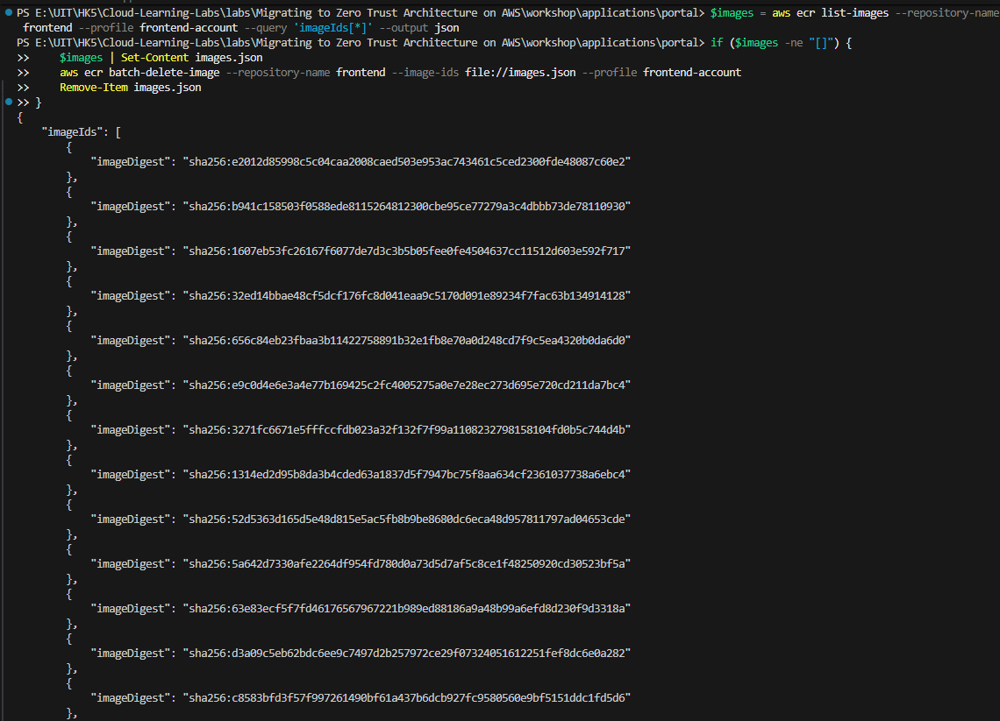


**Troubleshooting Failures:**
If you see `failures` in the output (e.g., `ImageReferencedByManifestList`), it means a parent manifest was deleted before its children. **Solution:** Simply **run the command block one more time** to clean up the remaining orphaned images.


**Note**: The `|| true` prevents the script from stopping if the repo is already empty.

### Step 2: Destroy Infrastructure (Terraform)

Destroy resources in the reverse order of creation (Backend → Frontend → Network).

```bash
# 1. Destroy Backend
cd backend/
terraform destroy -auto-approve

> [!TIP]
> **Troubleshooting: "waiting for delete... HealthCheckNotSupported" or "UNAVAILABLE"**
> If you encounter this error during backend destruction, it is a known timing issue with VPC Lattice Target Groups and ALBs.
> **Solution:** Simply **run `terraform destroy -auto-approve` again**. The stuck resources will usually be cleaned up on the second attempt.

# 2. Destroy Frontend
cd ../frontend/
terraform destroy -auto-approve

# 3. Destroy Network
cd ../network/
terraform destroy -auto-approve
```


### Step 3: Clean up Logs (Hidden Costs)

Terraform often leaves CloudWatch Log Groups behind. Delete them manually or via CLI to save storage costs.

```bash
# Linux/Mac
# Frontend Account Logs
aws logs describe-log-groups --query 'logGroups[*].logGroupName' --output text --profile frontend-account | \
xargs -I {} aws logs delete-log-group --log-group-name {} --profile frontend-account

# Backend Account Logs
aws logs describe-log-groups --query 'logGroups[*].logGroupName' --output text --profile backend-account | \
xargs -I {} aws logs delete-log-group --log-group-name {} --profile backend-account
```

```powershell
# Windows (PowerShell)
# Frontend Account Logs
$logs = aws logs describe-log-groups --query 'logGroups[*].logGroupName' --output json --profile frontend-account | ConvertFrom-Json
if ($logs) { $logs | ForEach-Object { aws logs delete-log-group --log-group-name $_ --profile frontend-account } }

# Backend Account Logs
$logs = aws logs describe-log-groups --query 'logGroups[*].logGroupName' --output json --profile backend-account | ConvertFrom-Json
if ($logs) { $logs | ForEach-Object { aws logs delete-log-group --log-group-name $_ --profile backend-account } }
```


### Step 4: Clean up Identity Center (Manual)

Since Task 1 was done manually, revert it manually in the Management Account (1400) to keep the organization clean.

#### Remove Account Assignments:

1. In IAM Identity Center, go to **AWS accounts** in the left sidebar.
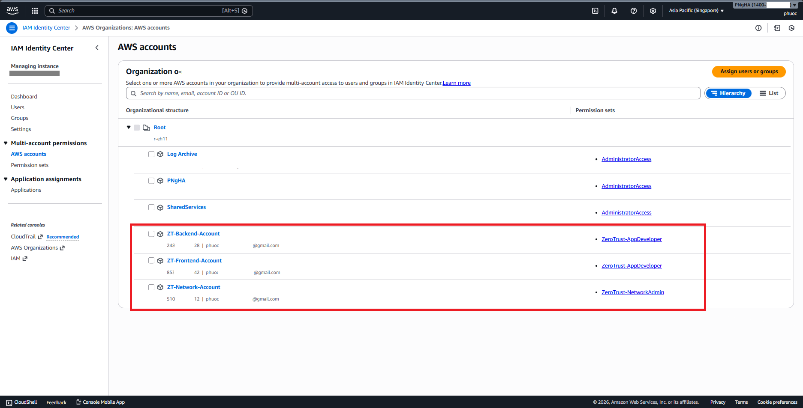
2. Click on the **name of each account** (e.g., `ZT-Network-Account`) to open its details.

3. Under the **Users or groups** tab, check the box next to the assigned users/groups (e.g., `ZeroTrust-Admins`).

4. Click **Remove access** and confirm.
5. Repeat for the other 2 accounts.


#### Delete Permission Sets:

1. Go to **Permission sets** > Select `ZeroTrust-NetworkAdmin`, `ZeroTrust-AppDeveloper`, etc. > **Delete**.
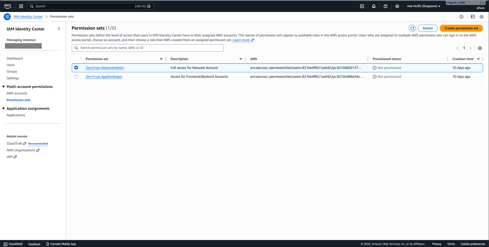

#### Delete Users/Groups (Optional):

- Delete `dev1` user and groups (`ZeroTrust-Admins`, `ZeroTrust-Developers`, `ZeroTrust-AppUsers`) if no longer needed.


### Step 5: Handling Member Accounts

1. Go to **AWS Organizations**.
2. Select the check box next to the member account name (e.g., `ZT-Backend-Account`).

3. Choose **Actions** > **Close**.
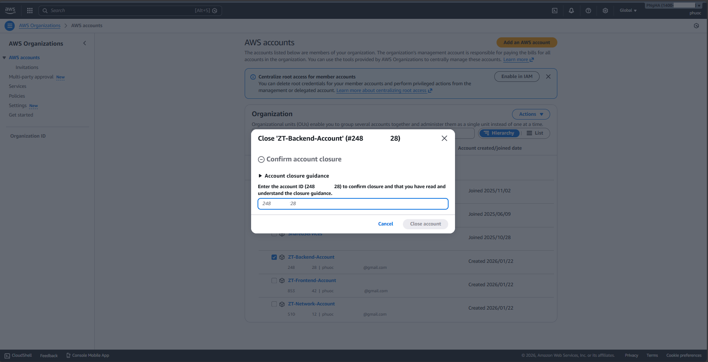
4. Follow the confirmation steps to close the account.
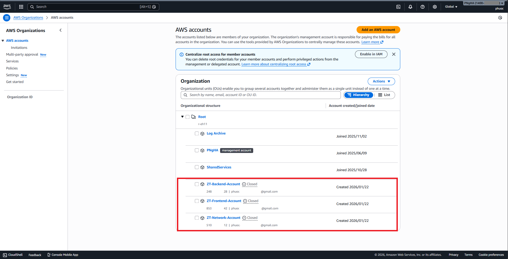
*   *Note: Closed accounts remain visible for a short time but are suspended immediately and permanently deleted after 90 days.*

---

## Key Takeaways

- Central auth with IAM Identity Center across multi-account
- VPN-less access via Verified Access with fine-grained policies
- Service-to-service connectivity simplified by VPC Lattice
- Terraform-first, repeatable deployment with lab-friendly costs

---

## Workshop Completion Status

| Section                              | Status |
| ------------------------------------ | ------ |
| Task 1: Identity Center Setup        | Complete |
| Task 2: CLI SSO Profiles             | Complete |
| Task 3: Repo & Variables             | Complete |
| Task 4: Networking Deploy            | Complete |
| Task 5: Frontend Deploy + Build      | Complete |
| Task 6: Backend Deploy + Build       | Complete |
| Task 7: Verified Access Test         | Complete |
| Task 8: Monitoring & Troubleshooting | Complete |
| Task 9: Cost Optimization            | Complete |
| Task 10: Cleanup                     | Complete |

---

## Additional Resources

- AWS Verified Access: https://docs.aws.amazon.com/verified-access/
- Amazon VPC Lattice: https://docs.aws.amazon.com/vpc-lattice/
- AWS Identity Center: https://docs.aws.amazon.com/singlesignon/
- AWS Organizations: https://docs.aws.amazon.com/organizations/

---
