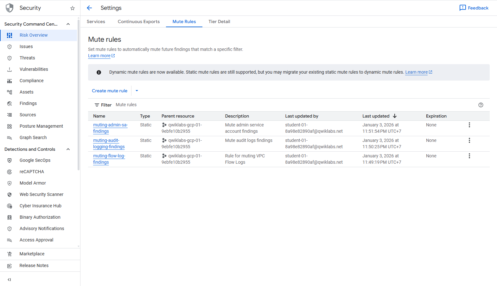
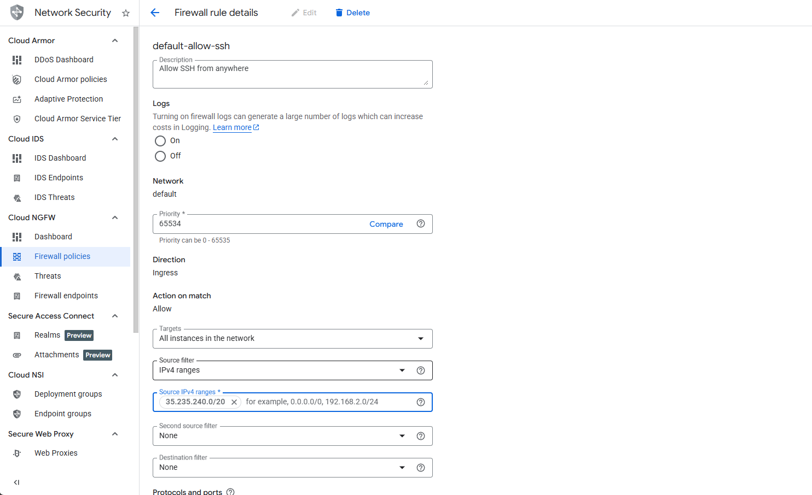
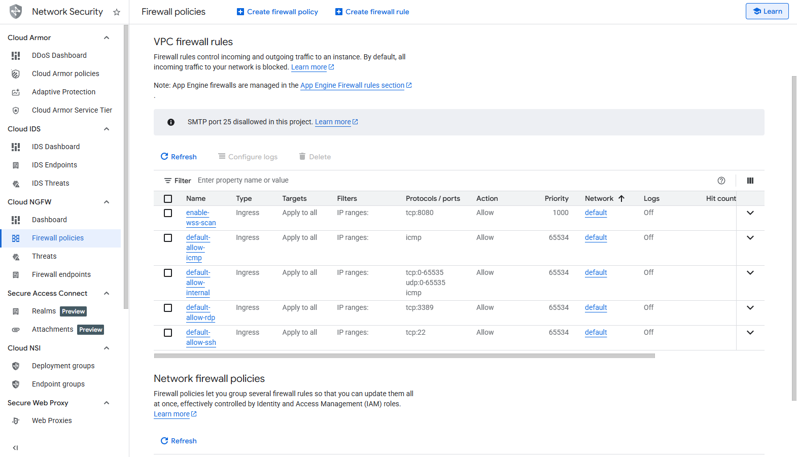
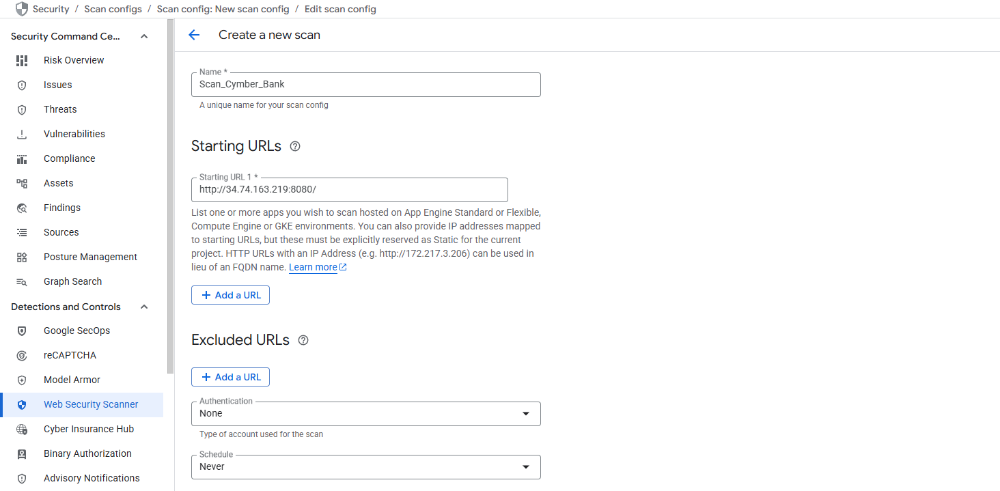
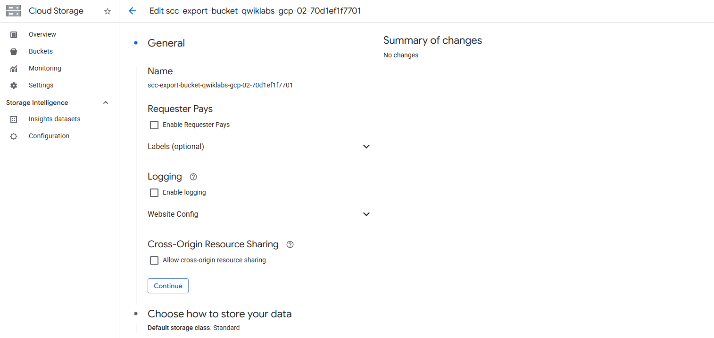
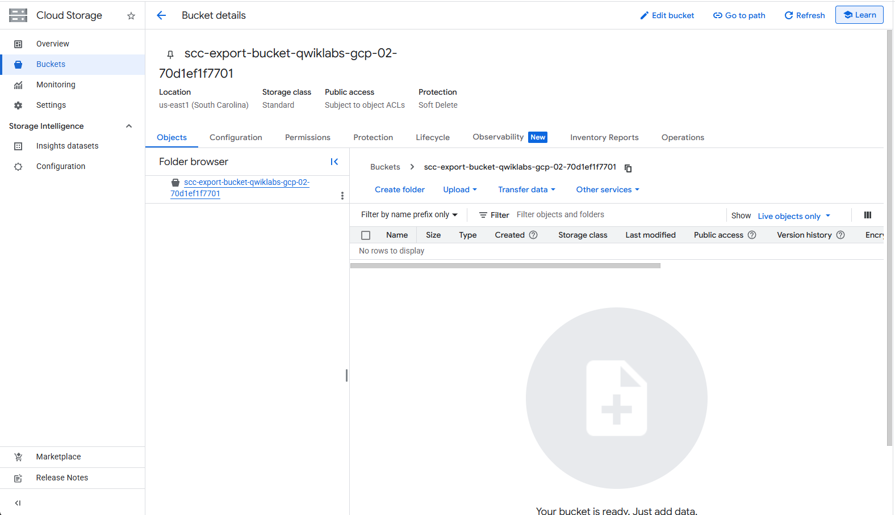

# Mitigate Threats and Vulnerabilities with Security Command Center - Challenge Lab Writeup

**Lab Code:** GSP382  
**Duration:** 40 minutes  
**Level:** Intermediate  
**Status:** Completed

**Author:** HoangBaoPhuoc (phuochb)  
**Mentor:** PNg HA (PNg-HA)

---

## Overview

This challenge lab tests proficiency in Google Cloud Security Command Center (SCC). The objective is to secure Cymbal Bank's Google Cloud environment by implementing threat detection, vulnerability mitigation, and compliance strategies without step-by-step guidance.

---

## Challenge Scenario

**Cymbal Bank** is a major American retail bank with 2,000+ branches, founded in 1920. As a cloud security engineer, your task is to:

- Secure the GCP environment using SCC features
- Implement advanced threat detection and mitigation
- Optimize access controls
- Ensure compliance with industry regulations

---

## Task 1: Configure the Environment

### Objective

Set up baseline configurations for Security Command Center to implement robust security controls.

### Steps

1. Navigate to **Security > Security Command Center > Findings**
2. Select **Last 180 days** from the time range selector
3. Verify the active vulnerabilities graph displays

**Important:** Always set the time range to **180 days** for all SCC interfaces throughout the challenge!

## 

## Task 2: Create Static Mute Rules for Cymbal Bank

### Objective

Create three static mute rules to suppress non-critical findings that Cymbal Bank doesn't want to surface.

### Mute Rules Configuration

| Name                            | Finding Type           | Description                         |
| ------------------------------- | ---------------------- | ----------------------------------- |
| `muting-flow-log-findings`      | Flow logs disabled     | Mute VPC Flow Logs findings         |
| `muting-audit-logging-findings` | Audit logging disabled | Mute audit logs findings            |
| `muting-admin-sa-findings`      | Admin service account  | Mute admin service account findings |

### Steps

1. In SCC Findings, navigate to **Mute Rules**
2. Click **Create Mute Rule** for each finding type
3. Enter the rule name and finding query (found by exploring Finding details)
4. Set the mute scope to cover the intended resources

### Verification

✅ All three mute rules successfully created and active

---

## Task 3: Analyze and Fix High Vulnerability Findings

### Objective

Identify and remediate two high-severity findings related to open ports:

- **Open SSH port** (Port 22)
- **Open RDP port** (Port 3389)

### Solution Approach

Ensure these ports are not exposed to the public internet. Use IP address `35.235.240.0/20` as a replacement for public-facing rules.

### Steps

1. In SCC Findings, filter for high-severity findings
2. Identify findings related to open SSH and RDP ports
3. Navigate to the affected Compute Engine instances or Firewall rules
4. Modify firewall rules to restrict access to `35.235.240.0/20` instead of `0.0.0.0/0`

### Verification

✅ Both open port vulnerabilities have been remediated
✅ Firewall rules now restrict access to `35.235.240.0/20`

---

## Task 4: Identify Application Vulnerabilities with Web Security Scanner

### Objective

Run SCC's Web Security Scanner against a sample banking application to identify application-level vulnerabilities.

### Prerequisites

1. **Make External IP Static:**

   - Navigate to **Compute Engine > VM instances > cls-vm**
   - Click **Edit**
   - In Network Interface, expand the default network
   - Click "External IPv4 address" dropdown > **Reserve Static External IP**
   - Name: `static-ip`
   - Click **Reserve** and **Save**

2. **Find the External IP** and note it

### Running the Web Security Scan

1. Access the application at: `http://<YOUR_EXTERNAL_IP>:8080`
2. Verify the Cymbal Bank corporate banking portal loads

3. In SCC, navigate to **Web Security Scanner** or **Security Scanning**
4. Create a new scan with the application URL
5. Run the scan and wait for completion

### Verification

✅ External IP successfully reserved as static
✅ Web Security Scan completed successfully
✅ Application vulnerabilities identified and reported

---

## Task 5: Export Findings to Google Cloud Storage

### Objective

Export all SCC findings to a GCS bucket for long-term auditing and compliance purposes.

### Bucket Specifications

- **Bucket Name:** `scc-export-bucket-<PROJECT_ID>`
- **Location Type:** Regional
- **Location:** [Your selected region]

### Step 1: Create the Google Cloud Storage Bucket

1. Navigate to **Cloud Storage > Buckets**
2. Click **Create Bucket**
3. Enter the bucket name: `scc-export-bucket-<PROJECT_ID>`
4. Select **Regional** location type
5. Choose your desired region

### Step 2: Configure Access Control

1. In the **Choose how to control access to objects** section:

   - Select **Prevent public access** option
   - Check **Enforce public access prevention on this bucket**

2. In the **Access control** section:
   - **Uncheck** the "Enforce public access prevention" option
   - Select **Fine-grained** access control to specify access to individual objects using object-level permissions (ACLs)

3. Complete bucket creation by clicking **Create**

### Step 3: Configure SCC Export Settings

1. In SCC Findings, click **Export** or navigate to **Settings > Exports**
2. Create a new export destination
3. Select the GCS bucket you created (`scc-export-bucket-<PROJECT_ID>`)
4. Configure the export settings:
   - **Filename:** `findings.jsonl`
   - **Format:** JSONL
   - **Time Range:** All time
5. Initiate the export

### Verification

✅ GCS bucket created with correct naming convention (`scc-export-bucket-<PROJECT_ID>`)
✅ Public access prevention configured with fine-grained access control
✅ Sample file uploaded and renamed to `findings.jsonl`
✅ All findings exported to `findings.jsonl` in JSONL format
✅ Export includes all findings from the entire time range

---

## Key Takeaways

1. **Security Command Center** is a comprehensive platform for managing security posture in GCP
2. **Mute Rules** help reduce alert fatigue by suppressing non-critical findings
3. **Firewall hardening** is critical for reducing infrastructure vulnerabilities
4. **Web Security Scanner** identifies application-level vulnerabilities
5. **Finding exports** enable long-term compliance and audit trail maintenance

---

## Challenge Completion Status

| Task                             | Status      |
| -------------------------------- | ----------- |
| Task 1: Configure Environment    | ✅ Complete |
| Task 2: Create Mute Rules        | ✅ Complete |
| Task 3: Fix High Vulnerabilities | ✅ Complete |
| Task 4: Web Security Scanning    | ✅ Complete |
| Task 5: Export to GCS            | ✅ Complete |

**Overall Score:** 100/100 ✅

---

## Additional Resources

- [Google Cloud Security Command Center Documentation](https://cloud.google.com/security-command-center/docs)
- [Web Security Scanner Guide](https://cloud.google.com/security-command-center/docs/using-web-security-scanner)
- [Cloud Storage Best Practices](https://cloud.google.com/storage/docs/best-practices)

---

\_Challenge Lab completed successfully!
