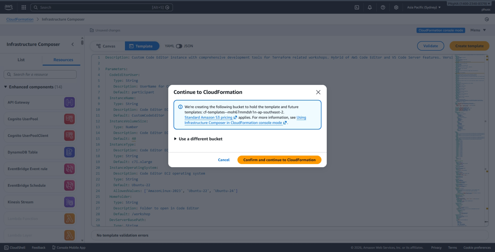
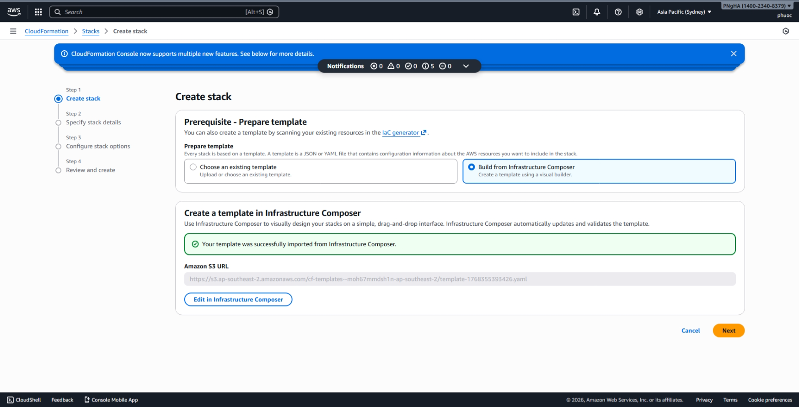
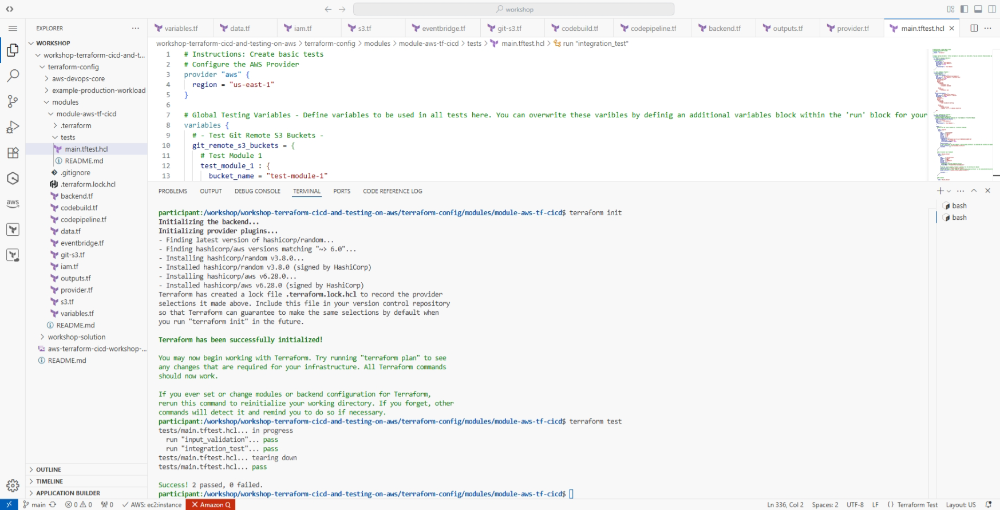
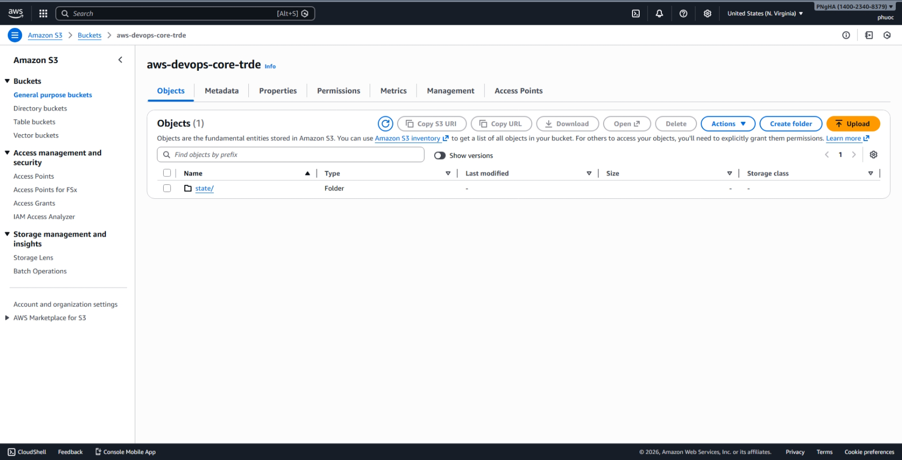
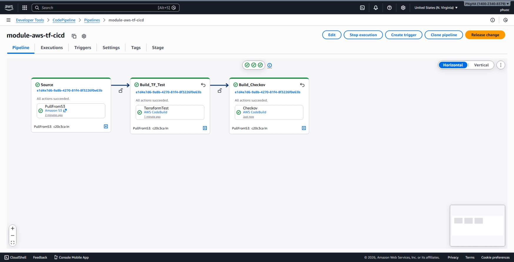
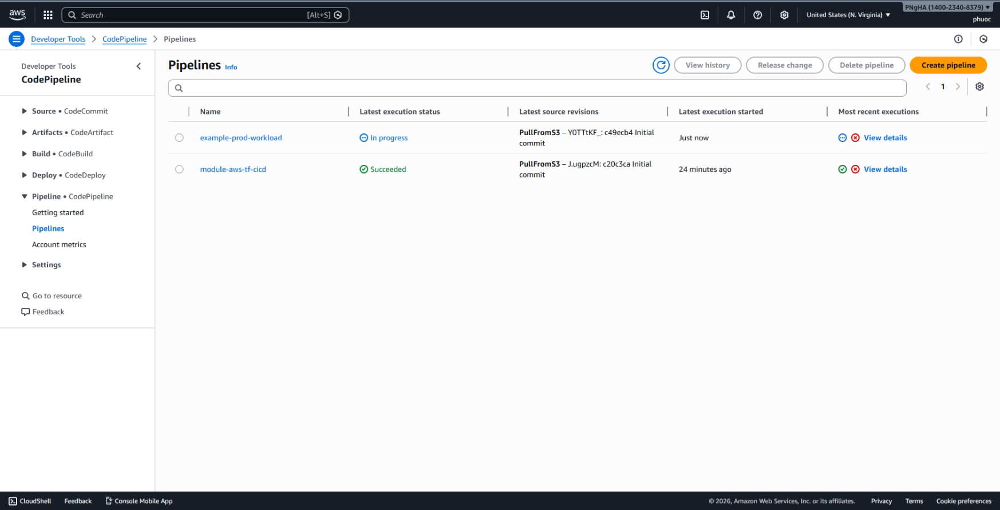
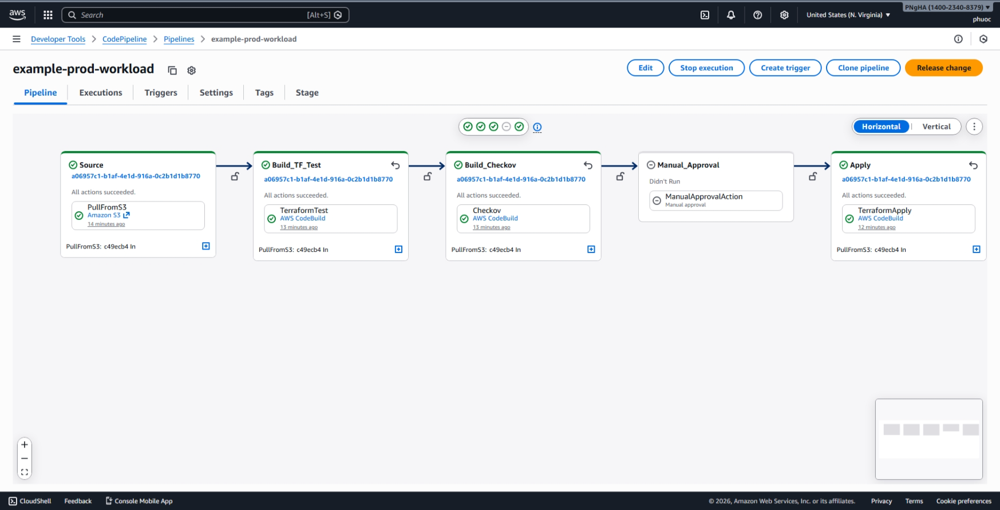
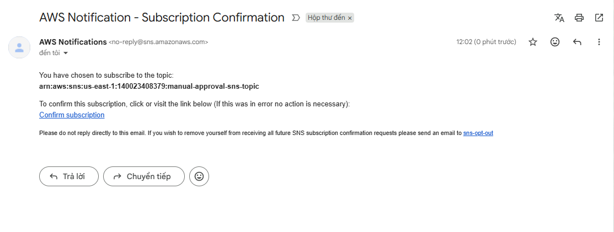
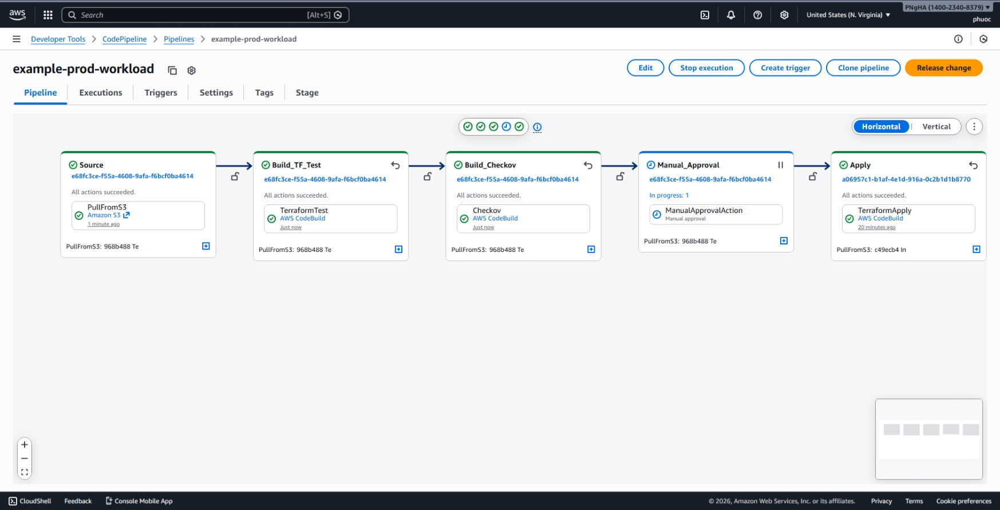

# Terraform CI/CD and Testing on AWS - Workshop Writeup

**Workshop Source:** AWS Workshop Studio
**Focus:** Infrastructure as Code, CI/CD Automation, Security Scanning, and Testing
**Level:** Intermediate
**Status:** COMPLETED

---

## Overview

This workshop demonstrates the implementation of a robust CI/CD pipeline for Terraform on AWS. The objective is to transition from manual infrastructure management to a fully automated, tested, and secure deployment workflow using AWS native tools and third-party security scanners.

---

## Workshop Scenario

As a Cloud Security Engineer, you are tasked with automating the deployment of AWS infrastructure for an enterprise environment. The solution ensures that all Terraform modules are validated for syntax, tested for logic using the Terraform Test Framework, and scanned for security vulnerabilities using Checkov before being deployed via AWS CodePipeline.

---

## Task 1: Environment Setup and IDE Configuration

### Objective

Prepare the development environment by configuring the Integrated Development Environment (IDE) and ensuring necessary CLI tools are installed.

### Steps

#### 1.1 AWS Account & Region Selection

Ensure programmatic administrator access is available. Recommended regions include `us-east-1`, `us-east-2`, or `us-west-2`.

#### 1.2 CloudFormation Stack Creation

1. On the Create stack page, in the **Prerequisite - Prepare template** section, select **Build from Infrastructure Composer** then **Create a template in Infrastructure Composer**.
   

2. Use the provided `custom-code-editor.yaml` template to provision a Code Editor environment on Amazon EC2.
   
   
   
   
   

3. Once the stack is created, select the **Outputs** tab to view the relevant values we will use in the next part of the workshop. In the Outputs tab, note the **Password** and **URL** values.

#### 1.3 Docker Installation on Ubuntu 22.04

Configure Docker on the EC2 instance:

- **Package Manager:** Used `apt` instead of `yum` due to Ubuntu-based environment
- **Service Management:** Enabled and started `docker.service` using `systemctl`
- **Permissions:** Added current user to the `docker` group to enable non-root execution, as required by the workshop

#### 1.4 Verify Tooling

Ensure the following are installed and accessible via terminal:

- `aws-cli` (v2)
- `terraform` & `tfenv`
- `checkov`
- `jq`, `git`, and `docker`


#### 1.5 IDE Extensions

Install the **HashiCorp Terraform** and **Amazon Q** extensions for Visual Studio Code to enhance development efficiency.


#### 1.6 Configure IDE and Clone Repository

Verify all resources are properly configured and successfully clone the workshop repository.


---

## Task 2: Local Terraform Module Development and Testing

### Objective

Develop a standardized Terraform module and perform localized testing to identify issues before committing code to the repository.

### Sub-task 2.1: Create Terraform Module

#### Overview

Create a well-structured Terraform module following best practices for organization and reusability.

#### Module Structure

1. **Provider Configuration (`providers.tf`):**

   - Define the AWS provider with the appropriate region
   - Configure provider version constraints
   - Set up any required provider features

2. **Resource Blocks (`main.tf`):**

   - Define core AWS resources (e.g., VPC, subnets, security groups, EC2 instances)
   - Implement proper resource dependencies
   - Use consistent naming conventions and tagging

3. **Variable Definitions (`variables.tf`):**

   - Declare input variables for parameterization
   - Include descriptions and type constraints
   - Set default values where appropriate
   - Add validation rules for critical variables

4. **Output Configuration (`outputs.tf`):**

   - Export important resource attributes
   - Provide values for use by other modules
   - Include descriptions for each output

5. **Variable Values (`terraform.tfvars`):**
   - Specify concrete values for variables
   - Environment-specific configurations

### Sub-task 2.2: Terraform Test Framework

#### Overview

Use the native Terraform Test Framework to validate module behavior without deploying actual infrastructure.

#### Test Implementation

1. **Create Test Files:**

   - Author `.tftest.hcl` files in the `tests/` directory
   - Define multiple test scenarios for different use cases
   - Test both success and failure conditions

2. **Test Structure:**

   - **Run blocks:** Define test scenarios with specific configurations
   - **Assert blocks:** Validate resource attributes and outputs
   - **Mock providers:** Test without creating real resources (where applicable)

3. **Execute Tests:**

   ```bash
   terraform test
   ```

4. **Validate Results:**
   - Review test output for passes and failures
   - Ensure all assertions succeed
   - Check for unexpected behaviors or edge cases

**Benefits:**

- Catch configuration errors early in development
- Validate module behavior across different input scenarios
- Ensure consistency and compliance with organizational standards
- Reduce deployment failures in CI/CD pipelines



---

### Sub-task 2.3: Security Scanning with Checkov

#### Overview

Perform static security analysis to identify misconfigurations and compliance violations before code reaches production.

#### Checkov Implementation

1. **Run Security Scan:**

   ```bash
   checkov -d . --compact
   ```

2. **Review Scan Results:**
   Analyze findings for common security issues:

   - **Storage Security:**
     - Unencrypted S3 buckets
     - Missing S3 bucket versioning
     - Unencrypted EBS volumes
   - **Network Security:**
     - Overly permissive security group rules (0.0.0.0/0)
     - Missing network ACL restrictions
     - Public subnet configurations
   - **Access Control:**
     - Overly broad IAM policies
     - Missing MFA requirements
     - Public access to sensitive resources
   - **Compliance:**
     - Missing encryption at rest
     - Unencrypted data in transit
     - Missing logging and monitoring

3. **Remediate Issues:**

   - Fix critical and high-severity findings immediately
   - Document accepted risks for low-severity findings
   - Update Terraform code to align with security best practices

4. **Verify Compliance:**
   - Re-run Checkov to confirm all critical issues are resolved
   - Generate compliance report for audit purposes

**Checkov Benefits:**

- Shift-left security approach
- Automated compliance validation against industry standards (CIS, PCI-DSS, HIPAA)
- Integration with CI/CD pipelines
- Support for multiple IaC frameworks (Terraform, CloudFormation, Kubernetes)
- Customizable policies for organizational requirements


---

## Task 3: CI/CD Pipeline Implementation

### Objective

Automate the deployment process by establishing a remote backend and implementing a multi-stage CI/CD pipeline using AWS native services.

---

### 3.1 Pipeline Architecture

#### Terraform Module Validation Pipeline

- **Source:** `module-aws-tf-cicd` S3 bucket
- **Purpose:** Validates module functionality and security
- **Stages:** Pull Code → Terraform Test → Checkov Scan

#### Terraform Deployment Pipeline

- **Source:** `example-production-workload` S3 bucket
- **Purpose:** Validates and deploys production infrastructure
- **Stages:** Pull Code → Terraform Test → Checkov Scan → Terraform Apply

---

### 3.2 Resources Overview

#### Pipelines & Build Projects

- **Pipelines:** `tf-module-validation-pipeline`, `tf-deployment-pipeline`
- **Build Projects:** TerraformTest and Checkov projects for each component
- **S3 Buckets:** Git repos (`module-aws-tf-cicd`, `aws-devops-core`, `example-production-workload`) and state buckets

---

### 3.3 Understanding Git-Remote-S3

This workshop uses **git-remote-s3** to simulate repositories without external providers.

**Key Features:**

- Protocol: `s3+zip://` instead of `https://`
- Trigger: S3 source action in CodePipeline
- EventBridge detects S3 changes and triggers pipeline

---

### 3.4 Deploy Infrastructure

#### Step 1: Navigate to Directory

```bash
cd /workshop/workshop-terraform-cicd-and-testing-on-aws/terraform-config/aws-devops-core
```

---

#### Step 2: Create Configuration Files

Create the following files with provided configurations:

**provider.tf** - AWS provider and backend (commented for now)

**locals.tf** - Centralized naming and configuration values

**variables.tf** - Input variables with defaults

**ecr.tf** - ECR repository for Checkov image (avoids DockerHub throttling)

**outputs.tf** - Exports S3 state bucket names for reference

**main.tf** - Uses the module created earlier to deploy all resources

---

#### Step 3: Verify and Deploy Resources

After verify docker, deploy the following terraform resources

```bash
terraform init
terraform plan
terraform apply -auto-approve
```

#### Step 4: Save Outputs

**Important:** Copy these values - you'll need them later!

```bash
Apply complete! Resources: 63 added, 0 changed, 0 destroyed.

Outputs:
aws_devops_core_s3_bucket_name = "aws-devops-core-tf-state-XXXX"
example_production_workload_s3_bucket_name = "example-prod-workload-tf-state-XXXX"
git_remote_s3_bucket_names = tomap({
  "aws_devops_core" = "aws-devops-core-XXXX"
  "example_production_workload" = "example-prod-workload-XXXX"
  "module_aws_tf_cicd" = "module-aws-tf-cicd-XXXX"
})
```


---

#### Step 6: Check CodePipeline (Expected Error)

Navigate to AWS Console → CodePipeline. You'll see pipelines with failed status.


Click on a pipeline to see details. The `PullFromS3` action failed because buckets are empty (no `main` branch yet).


**This error is expected!** Pipelines will succeed once we push code to the repositories.

---

### 3.5 Configure S3 Remote Backend

#### Why Remote State?

Local state files prevent collaboration. Remote backends (S3) enable:

- Centralized state storage
- Team collaboration
- State locking (prevents concurrent modifications)
- Version control with S3 versioning

---

#### Step 1: Edit provider.tf

Uncomment the backend block (press `CMD + /` on Mac or `CTRL + /` on Windows):

```hcl
backend "s3" {
  bucket         = "add-your-bucket-name-here"
  key            = "state/terraform.tfstate"
  region         = "us-east-1"
  encrypt        = true
  use_lockfile   = true
}
```

---

#### Step 2: Update Bucket Name

Replace `"add-your-bucket-name-here"` with your `aws_devops_core_s3_bucket_name` from outputs.

**Example:**

```hcl
backend "s3" {
  bucket         = "aws-devops-core-tf-state-XXXX"
  key            = "state/terraform.tfstate"
  region         = "us-east-1"
  encrypt        = true
  use_lockfile   = true
}
```

**Note on State Locking:** The `use_lockfile` argument enables state locking using S3 conditional writes (new in Terraform 1.10+). Previously required DynamoDB.

---

#### Step 3: Migrate State

```bash
terraform init
```

When prompted to copy existing state, type `yes`:

```
Do you want to copy existing state to the new backend?
Enter a value: yes
```

You should see:

```
Successfully configured the backend "s3"!
```


---

#### Step 4: Verify in S3

Navigate to S3 Console → Select bucket starting with `aws-devops-core-tf-state`.

You should see: `state/` folder containing `terraform.tfstate` file.




---

### 3.6 Trigger Module Validation Pipeline

#### Step 1: Navigate to Module Directory

```bash
cd ../modules/module-aws-tf-cicd
```

---

#### Step 2: Initialize Git Repository

```bash
git init
git branch -M main
```

---

#### Step 3: Configure Git Remote

Get your S3 bucket name from outputs:

```bash
# View all outputs
terraform -chdir=../../aws-devops-core output

# Or get specific bucket name
terraform -chdir=../../aws-devops-core output -json git_remote_s3_bucket_names | jq -r '."module_aws_tf_cicd"'
```

Add remote (replace `module-aws-tf-cicd-XXXX` with your actual bucket name):

```bash
git remote add origin s3+zip://module-aws-tf-cicd-XXXX/s3-repo
```

**Important:** Include `/s3-repo` suffix - EventBridge looks for this pattern!

---

#### Step 4: Verify Remote

```bash
git remote -v
```

Expected output:

```
origin  s3+zip://module-aws-tf-cicd-XXXX/s3-repo (fetch)
origin  s3+zip://module-aws-tf-cicd-XXXX/s3-repo (push)
```

---

#### Step 5: Push Code

```bash
git add .
git commit -m "Initial commit"
git push origin -u main
```

---

#### Step 6: Monitor Pipeline Execution

Navigate to AWS Console → CodePipeline.

The `tf-module-validation-module-aws-tf-cicd` pipeline status should be **In progress**.


After a few minutes, the pipeline should complete successfully.




Click on the pipeline name to view detailed logs for each stage.

---

### 3.7 Trigger Deployment Pipeline

#### Step 1: Navigate to Production Workload Directory

```bash
cd ../../example-production-workload
```

---

#### Step 2: Configure provider.tf

Uncomment backend block and update with `example_production_workload_s3_bucket_name`:

Get bucket name:

```bash
terraform -chdir=../aws-devops-core output example_production_workload_s3_bucket_name
```

Updated provider.tf:

```hcl
backend "s3" {
  bucket         = "example-prod-workload-tf-state-XXXX"
  key            = "state/terraform.tfstate"
  region         = "us-east-1"
  encrypt        = true
  use_lockfile   = true
}
```

---

#### Step 3: Create variables.tf and main.tf

**variables.tf** - Input variables with defaults

**main.tf** - Production workload resources (IAM role, S3 bucket)

Note: main.tf includes Checkov skip directives for non-critical findings

---

#### Step 4: Create Tests

**tests/main.tftest.hcl** - Integration tests validating:

- IAM role naming conventions
- Trust policy configuration
- S3 bucket naming

---

#### Step 5: Initialize Git and Configure Remote

```bash
git init
git branch -M main
```

Get bucket name:

```bash
terraform -chdir=../aws-devops-core output -json git_remote_s3_bucket_names | jq -r '."example_production_workload"'
```

Add remote:

```bash
git remote add origin s3+zip://example-prod-workload-XXXX/s3-repo
```

Verify:

```bash
git remote -v
```

Expected output:

```
origin  s3+zip://example-prod-workload-XXXX/s3-repo (fetch)
origin  s3+zip://example-prod-workload-XXXX/s3-repo (push)
```

---

#### Step 6: Push Code

```bash
git add .
git commit -m "Initial commit"
git push origin -u main
```

---

#### Step 7: Monitor Deployment Pipeline

Navigate to AWS Console → CodePipeline.

The `tf-deployment-example-production-workload` pipeline status should be **In progress**.



After a few minutes, pipeline completes successfully and deploys production infrastructure:


---

### 3.7 Multi-Account Considerations

#### Enterprise Architecture

For production environments, workloads should be deployed across multiple AWS accounts:

- **Shared Services Account:** Houses CI/CD pipelines, security tools, AWS Organizations/SSO
- **Production Account:** Production workloads and resources
- **Development/Staging Accounts:** Separate environments per team or project


---

#### Cross-Account Deployment

To deploy resources in different accounts, use **cross-account IAM roles** with the `assume_role` option:

```hcl
provider "aws" {
  region = "us-east-1"
  assume_role {
    role_arn = "arn:aws:iam::123456789012:role/iac"
  }
}
```

**How It Works:**

1. IAM Role in Shared Services Account assumes role in Production Account via STS
2. STS returns temporary credentials
3. Terraform uses credentials to provision resources in Production Account

[Paste screenshot - Terraform Cross-Account Access diagram]

**Best Practices:**

- Separate S3 state bucket per account (managed centrally)
- Configure IAM permissions for cross-account access
- Use least privilege principle for assumed roles

---

## Task 4: Manual Approval and Notifications

### Objective

Implement a governance layer within the pipeline to ensure manual review of infrastructure changes before production deployment.

---

### 4.1 Add Manual Approval Stage

In this section, we'll enhance the Terraform Deployment Pipeline by adding a manual approval step before the Apply stage. This ensures changes are reviewed by stakeholders before deployment.

#### Step 1: Navigate to Directory

```bash
cd /workshop/workshop-terraform-cicd-and-testing-on-aws/terraform-config/aws-devops-core
```

---

#### Step 2: Update main.tf

Open `main.tf` and add the manual approval stage configuration between the **Build_Checkov** and **Apply** stages in the `tf_deployment_example_production_workload` pipeline.

**Add this configuration:**

```hcl
# Add Manual Approval
{
  name = "Manual_Approval"
  action = [
    {
      name     = "ManualApprovalAction"
      category = "Approval"
      owner    = "AWS"
      provider = "Manual"
      version  = "1"
      configuration = {
         CustomData      = "Please approve this deployment."
      }

      input_artifacts = []
      output_artifacts = []

      run_order = 4
    },
  ]
},
```

**Important:**

- Place this stage AFTER Build_Checkov (run_order = 3)
- Update the Apply stage `run_order` to `5`
- Stages are executed in the order they appear in the configuration

---

#### Step 3: Apply Changes

```bash
terraform plan
terraform apply -auto-approve
```


---

#### Step 4: Verify Manual Approval Stage

Navigate to AWS Console → CodePipeline → Select `tf-deployment-example-production-workload`.

You should see the new `Manual_Approval` stage between `Build_Checkov` and `Apply`.



---

### 4.2 Add SNS Notifications

Now let's implement Amazon SNS to notify stakeholders when manual approval is needed.

#### Step 1: Create SNS Topic and Subscription

At the **top** of `main.tf` (outside the module configuration), add:

```hcl
resource "aws_sns_topic" "manual_approval_sns_topic" {
  name = "manual-approval-sns-topic"
}

resource "aws_sns_topic_subscription" "manual_approval_sns_subscription" {
  topic_arn = aws_sns_topic.manual_approval_sns_topic.arn
  protocol  = "email"
  endpoint  = "your@email.com"  # Replace with your email address
}
```

**Important:** Replace `your@email.com` with your actual email address.

---

#### Step 2: Update Manual Approval Configuration

In the `Manual_Approval` stage configuration, add the SNS notification:

```hcl
configuration = {
   CustomData      = "Please approve this deployment."
   NotificationArn = aws_sns_topic.manual_approval_sns_topic.arn
}
```

**Complete Manual Approval Stage:**

```hcl
# Add Manual Approval
{
  name = "Manual_Approval"
  action = [
    {
      name     = "ManualApprovalAction"
      category = "Approval"
      owner    = "AWS"
      provider = "Manual"
      version  = "1"
      configuration = {
         CustomData      = "Please approve this deployment."
         NotificationArn = aws_sns_topic.manual_approval_sns_topic.arn
      }

      input_artifacts = []
      output_artifacts = []

      run_order = 4
    },
  ]
},
```

---

#### Step 3: Apply SNS Configuration

```bash
terraform plan
terraform apply -auto-approve
```


---

#### Step 4: Confirm SNS Subscription

Check the email address you provided. You should receive a subscription confirmation email from AWS SNS.

Click **"Confirm subscription"** in the email.




Once confirmed, you'll receive email notifications whenever manual approval is needed.

Troubleshooting Tip: SNS Subscription Loop
Issue: Receiving an "Unsubscribe Confirmation" email immediately after attempting to subscribe.

Root Cause: This is often caused by corporate email filters, security scanners, or browser extensions that automatically "pre-click" links in emails to check for malicious content. In doing so, they inadvertently trigger the Unsubscribe link located near the confirmation button.

Solution: > 1. Click the "Resubscribe" link in the most recent AWS notification email. 2. Once the new "Subscription Confirmation" email arrives, right-click the "Confirm subscription" link and select "Open in Incognito/Private Window". 3. Verify in the AWS SNS Console that the subscription status has successfully transitioned to Confirmed.

---

### 4.3 Test Manual Approval Workflow

#### Step 1: Navigate to Production Workload

```bash
cd ../example-production-workload
```

---

#### Step 2: Make a Code Change

Open `main.tf` and update the S3 bucket prefix:

**Before:**

```hcl
resource "aws_s3_bucket" "example" {
  bucket_prefix = "example-prod-resource"
  force_destroy = true
  ...
}
```

**After:**

```hcl
resource "aws_s3_bucket" "example" {
  bucket_prefix = "example-prod-resource-new"
  force_destroy = true
  ...
}
```

---

#### Step 3: Push Changes

```bash
git add .
git commit -m "Test Manual Approval"
git push origin -u main
```


---

#### Step 4: Monitor Pipeline

Navigate to AWS Console → CodePipeline → Select `tf-deployment-example-production-workload`.

Watch the pipeline progress through:

- Source
- Build_TF_Test
- Build_Checkov
- **Manual_Approval** (Pipeline pauses here)



---

#### Step 5: Receive Email Notification

Check your email. You should receive an approval notification containing:

- Pipeline name
- Custom message: "Please approve this deployment."
- Link to approve or reject


---

#### Step 6: Review and Approve

**In the Email:**
Click the link next to **"Approve or reject:"**

**In AWS Console:**

1. Click on `ManualApprovalAction` in the pipeline
2. Click **"Revisions"** to see the commit that triggered the pipeline
3. Review the changes made in the commit
4. Select the **"Approve"** radio button
5. Optionally add a comment
6. Click **"Submit"**


---

#### Step 7: Verify Apply Execution

After approval, the pipeline continues to the `Apply` stage and deploys the infrastructure changes.


---

### 4.4 Approval Best Practices

**Review Checklist:**

- [ ] Terraform plan shows expected changes only
- [ ] No unintended resource deletions or modifications
- [ ] Security configurations follow organizational standards
- [ ] Encryption enabled where required
- [ ] Tagging standards applied
- [ ] Cost impact is acceptable
- [ ] Change aligns with change management process

**Notification Best Practices:**

- Include plan summary or link in notification
- Add relevant documentation links
- Set approval timeout periods
- Configure escalation paths for delayed approvals
- Consider multiple approvers for critical environments

---

## Task 5: Resource Cleanup

### Objective

Deprovision all created resources to ensure cost optimization and prevent ongoing charges.

---

### 5.1 Delete Example Production Resources

#### Step 1: Navigate to Production Workload Directory

```bash
cd /workshop/workshop-terraform-cicd-and-testing-on-aws/terraform-config/example-production-workload
```

---

#### Step 2: Remove Resource Configurations

Open `main.tf` and `main.tftest.hcl` files. **Delete or comment out ALL contents** in both files.

**Important:** Failure to remove all contents will cause the pipeline to fail. Ensure both files are either empty or fully commented out.

Save all changes: **File → Save All**

---

#### Step 3: Push Changes to Trigger Destroy

When you run `terraform apply`, Terraform compares your configuration files against the state file. Since we've removed all resource declarations, Terraform will detect that resources exist in the state file but not in the configuration, and will create an execution plan to **destroy** those resources.

```bash
git add .
git commit -m "Remove all Example Production Workload TF Resources"
git push
```

---

#### Step 4: Monitor Pipeline Execution

Navigate to AWS Console → CodePipeline Dashboard.

The Terraform Deployment Pipeline will start running. Wait for it to complete.

**Important:** If you completed the Manual Approval section, you'll receive an email notification. **You must approve** the changes for the pipeline to continue and destroy resources.


---

### 5.2 Destroy AWS DevOps Core Infrastructure

Now let's delete the Git Remote S3 Buckets, CodeBuild Projects, CodePipeline pipelines, and all related infrastructure.

#### Step 1: Navigate to aws-devops-core Directory

```bash
cd ../aws-devops-core
```

---

#### Step 2: Remove S3 Backend Configuration

Open `provider.tf` and **delete or comment out** the backend block.

**Before (With S3 Backend):**

```hcl
terraform {
  required_providers {
    aws = {
      source  = "hashicorp/aws"
      version = "~> 6.0"
    }
  }

  backend "s3" {
    bucket         = "aws-devops-core-tf-state-XXXX"
    key            = "state/terraform.tfstate"
    region         = "us-east-1"
    encrypt        = true
    use_lockfile   = true
  }
}

provider "aws" {
  region = var.aws_region

  default_tags {
    tags = {
      Management = "Terraform"
    }
  }
}
```

**After (Without S3 Backend):**

```hcl
terraform {
  required_providers {
    aws = {
      source  = "hashicorp/aws"
      version = "~> 6.0"
    }
  }

  # Backend block removed - Terraform will operate locally
}

provider "aws" {
  region = var.aws_region

  default_tags {
    tags = {
      Management = "Terraform"
    }
  }
}
```

Save the file: **File → Save All**

---

#### Step 3: Migrate State from S3 to Local

```bash
terraform init -migrate-state
```

When prompted: **"Do you want to copy existing state from S3 to the new local backend?"**

Type `yes` and press Enter.

You should see:

```
Successfully unset the backend "s3". Terraform will now operate locally.

Initializing provider plugins...
- Reusing previous version of hashicorp/aws from the dependency lock file
- Using previously-installed hashicorp/aws v5.34.0

Terraform has been successfully initialized!
```


---

#### Step 4: Destroy All Infrastructure

```bash
terraform destroy -auto-approve
```

This will destroy:

- Git Remote S3 Buckets (module-aws-tf-cicd, aws-devops-core, example-production-workload)
- Terraform State S3 Buckets
- CodePipeline pipelines
- CodeBuild projects
- ECR repository
- SNS topic and subscriptions
- IAM roles and policies
- EventBridge rules
- All related infrastructure

Wait for the command to complete. You should see:

```
Destroy complete! Resources: 64 destroyed.
```


Cleanup Troubleshooting: Validation Error during Destroy
Issue: Encountered Error: filter_policy is required when filter_policy_scope is set during the final destruction phase.

Root Cause: Strict validation rules in the AWS Provider v6.x prevented the state refresh because of a mismatch in SNS subscription attributes, even during a delete operation.

Resolution: > \* Executed terraform state rm aws_sns_topic_subscription.manual_approval_sns_subscription to decouple the problematic resource from the Terraform state.

Successfully ran terraform destroy for the remaining 60+ resources.

Performed a final manual cleanup in the AWS SNS Console to ensure no orphan subscriptions remained.

---

### 5.3 Delete CloudFormation Stack (If Applicable)

If you followed the **"On your own - Bring your own AWS Account"** path and deployed the CloudFormation template for the Code Editor:

#### Step 1: Navigate to CloudFormation

Go to AWS Console → CloudFormation

---

#### Step 2: Delete Stack

1. Find the stack (likely named `Terraform-CICD-Workshop`)
2. Select the stack
3. Click **Delete**
4. Confirm deletion

This will terminate the EC2 instance running the Code Editor and remove all related resources.


---

### 5.4 Cleanup Verification Checklist

Verify all resources have been removed:

**Infrastructure Resources:**

- [ ] Example production workload resources destroyed (IAM role, S3 bucket)
- [ ] CodePipeline pipelines deleted (tf-module-validation, tf-deployment)
- [ ] CodeBuild projects deleted (TerraformTest, Checkov, TFApply projects)
- [ ] Git Remote S3 buckets deleted (module-aws-tf-cicd, aws-devops-core, example-production-workload)
- [ ] Terraform State S3 buckets deleted (aws-devops-core-tf-state, example-prod-workload-tf-state)
- [ ] ECR repository deleted (checkov)
- [ ] SNS topic deleted (manual-approval-sns-topic)
- [ ] SNS email subscription removed
- [ ] IAM roles and policies deleted
- [ ] EventBridge rules deleted

**Workshop Environment:**

- [ ] CloudFormation stack deleted (if applicable)
- [ ] EC2 Code Editor instance terminated (if applicable)
- [ ] No remaining resources in AWS account

---

### 5.5 Final Cost Verification

**Check for Unexpected Charges:**

1. Navigate to AWS Cost Explorer
2. Review costs for the last 7 days
3. Look for any unexpected charges
4. Set up billing alerts for future monitoring

**Common Resources to Double-Check:**

- S3 buckets (ensure all are deleted or empty)
- EC2 instances (ensure all are terminated)
- NAT Gateways (if any were created)
- Elastic IPs (ensure none are allocated)
- EBS volumes (ensure none are orphaned)

---

## Key Takeaways

### 1. State Management

**Utilizing S3 and DynamoDB for remote state is essential for:**

- Team collaboration and concurrent development
- Pipeline stability and consistency
- State history and disaster recovery
- Preventing state file corruption
- Audit trails and change tracking

### 2. Shift-Left Security

**Integrating Checkov early in the development lifecycle:**

- Prevents security debt accumulation
- Reduces risk of deploying vulnerable infrastructure
- Enforces compliance with industry standards (CIS, PCI-DSS, HIPAA)
- Catches misconfigurations before production
- Provides actionable remediation guidance

### 3. Automated Validation

**The Terraform Test Framework provides:**

- Rigorous logic verification without infrastructure costs
- Confidence in module behavior across different scenarios
- Regression testing for code changes
- Documentation through executable tests
- Faster feedback loops for developers

### 4. Pipeline Orchestration

**AWS CodePipeline delivers:**

- Seamless integration with AWS native services
- Automated end-to-end IaC workflows
- Visual pipeline monitoring and troubleshooting
- Scalable and reliable deployment processes
- Native integration with AWS security and compliance tools

### 5. Governance and Compliance

**Manual approval gates ensure:**

- Human oversight for critical changes
- Alignment with change management processes
- Risk mitigation through peer review
- Audit trails for compliance requirements
- Controlled deployment cadence

### 6. Infrastructure as Code Best Practices

**Key principles demonstrated:**

- Version control for all infrastructure code
- Modular and reusable Terraform configurations
- Automated testing at multiple levels
- Security scanning as part of CI/CD
- Immutable infrastructure deployments

---

## Workshop Completion Status

| Section                                    | Status       |
| ------------------------------------------ | ------------ |
| Task 1: Environment Configuration          | ✅ COMPLETED |
| Task 2: Local Module Development & Testing | ✅ COMPLETED |
| Task 3: CI/CD Pipeline Implementation      | ✅ COMPLETED |
| Task 4: Manual Approval Gates              | ✅ COMPLETED |
| Task 5: Resource Cleanup                   | ✅ COMPLETED |

**Overall Result:** ✅ SUCCESSFUL

---

## Additional Resources

### Terraform Resources

- [Terraform Documentation](https://www.terraform.io/docs)
- [Terraform Test Framework Guide](https://developer.hashicorp.com/terraform/language/tests)
- [Terraform Best Practices](https://www.terraform-best-practices.com/)

### AWS CI/CD Resources

- [AWS CodePipeline Documentation](https://docs.aws.amazon.com/codepipeline/)
- [AWS CodeBuild Documentation](https://docs.aws.amazon.com/codebuild/)
- [AWS CodeCommit Documentation](https://docs.aws.amazon.com/codecommit/)

### Security and Compliance

- [Checkov Documentation](https://www.checkov.io/documentation.html)
- [AWS Security Best Practices](https://aws.amazon.com/architecture/security-identity-compliance/)
- [CIS AWS Foundations Benchmark](https://www.cisecurity.org/benchmark/amazon_web_services)

### Community and Support

- [HashiCorp Community Forum](https://discuss.hashicorp.com/)
- [AWS re:Post](https://repost.aws/)
- [Terraform Registry](img/https://registry.terraform.io/)
